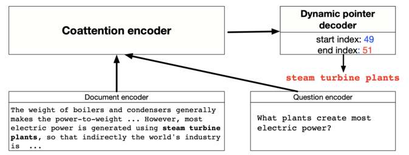

# Dynamic Coattention Networks
Implementation of the paper `"DYNAMIC COATTENTION NETWORKS FOR QUESTION ANSWERING"` in pytorch.

## Abstract 
Several deep learning models have been proposed for question answering. How- ever, due to their single-pass nature, they have no way to recover from local max- ima corresponding to incorrect answers. To address this problem, we introduce the Dynamic Coattention Network (DCN) for question answering. The DCN first fuses co-dependent representations of the question and the document in order to focus on relevant parts of both. Then a dynamic pointing decoder iterates over po- tential answer spans. This iterative procedure enables the model to recover from initial local maxima corresponding to incorrect answers. On the Stanford question answering dataset, a single DCN model improves the previous state of the art from 71.0% F1 to 75.9%, while a DCN ensemble obtains 80.4% F1.

## Model Architecture

### Overview  
   
### Coattention Encoder         
### Dynamic Decoder         
### Highway Maxout Network          
  
## Setup Instructions and Dependencies
You may setup the repository on your local machine by either downloading it or running the following line on `terminal`.
``` Batchfile
git clone https://github.com/h3lio5/dynamic-coattention-networks-pytorch.git
```
All dependencies required by this repository can be downloaded by creating a virtual environment with Python 3.7 and running
``` Batchfile
python3 -m venv .env
source .env/bin/activate
pip install -r requirements.txt
```
All the data required to train and evaluate can be downloaded and preprocessed by running      
``` Batchfile
python dcn/utils/preprocess.py
```
